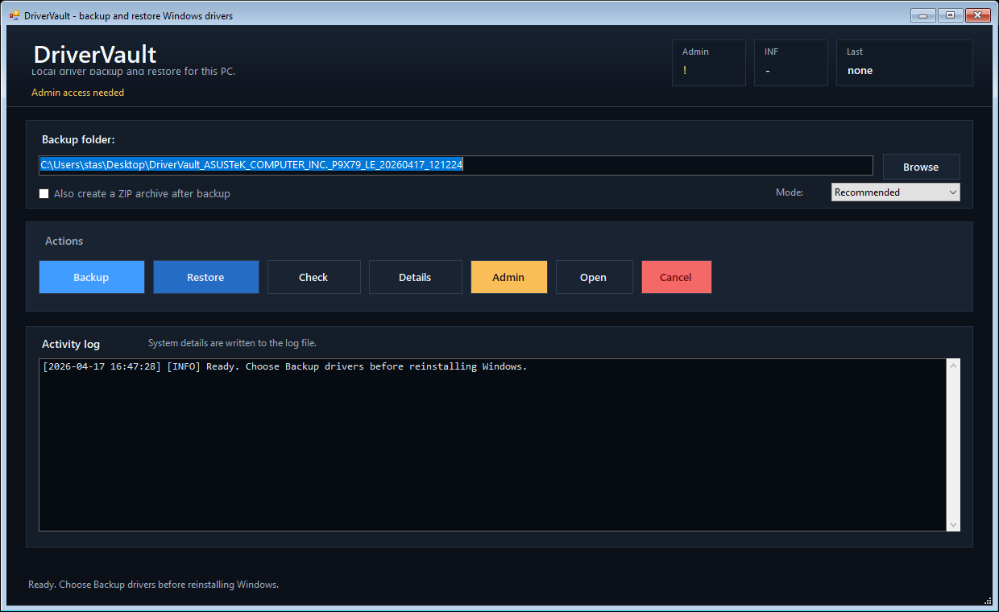

# DriverVault Documentation

DriverVault is a small Windows utility that backs up the drivers already installed on a computer and helps restore them after Windows is reinstalled. It is designed for the common situation where the PC works now, but you want a local driver backup before wiping the system.

DriverVault uses built-in Windows tools instead of third-party driver packs. That keeps the process predictable, offline-friendly and easier to audit.

## Main Features

- Graphical interface for backup, validation, inspection and restore.
- Russian and English interface language.
- Recommended backup mode for normal third-party driver export.
- Full backup mode that copies the DriverStore package folders directly.
- SHA256 integrity file for later validation.
- Dry-run restore mode that checks the backup and lists which INF packages would be added without installing drivers.
- Clear recovery errors for missing Administrator rights, busy files, damaged backup folders, missing INF files and wrong-PC backups.
- Machine manifest with manufacturer, model, OS and backup metadata.
- Automatic Administrator restart for backup and restore actions.
- Cancel button for long operations.
- Simple on-screen log plus detailed logs in the backup folder.
- No repeated confirmation popups during backup or restore.

## Screenshot



## What DriverVault Is For

Use DriverVault when:

- You are about to reinstall Windows on the same machine.
- You want a local copy of working drivers before changing disks or reinstalling the OS.
- The machine has old, rare or vendor-specific drivers that may be annoying to find later.
- You want a safer alternative to random online driver packs.

DriverVault is not a driver updater. It does not search the internet, download newer drivers, replace Windows Update or guarantee that a backup from one PC is suitable for another PC.

## Requirements

- Windows 10 or Windows 11.
- Windows PowerShell 5.1.
- Administrator rights for backup and restore.
- Enough free disk space for the backup folder.
- Optional internet access only if you want the build script to install PS2EXE for the current user.

## Download for Non-Programmers

If you do not want to work with source code, download the ready-to-run EXE from GitHub Releases:

[Download DriverVault.exe](https://github.com/StanislavDjango/Driver-Backup/releases/latest/download/DriverVault.exe)

Then right-click `DriverVault.exe` and choose **Run as administrator**.

Windows may show a SmartScreen warning for new open-source EXE files that are not code-signed yet. This does not automatically mean the file is dangerous; it means Windows has not seen enough downloads from this publisher. If you are unsure, use the PowerShell source version from this repository or ask someone technical to review it.

## Backup Modes

| Mode | What it does | When to use it |
| --- | --- | --- |
| Recommended | Runs `pnputil /export-driver *` and falls back to DISM if needed. | Best default choice for most users. |
| Full | Copies driver package folders from `C:\Windows\System32\DriverStore\FileRepository`. | Use when export tools fail or when you want the most complete local copy. |

Recommended mode is usually smaller and cleaner. Full mode can be much larger, but it can save packages that export tools refuse to export on some systems.

## Backup Workflow

1. Open the project folder.
2. Right-click `DriverVault.cmd`.
3. Choose **Run as administrator**.
4. Select the backup folder.
5. Choose **Recommended** or **Full**.
6. Enable ZIP creation only if you want an extra archive after backup.
7. Click **Backup**.
8. Wait for the final success message.
9. Copy the whole backup folder to a USB drive, external disk or another safe location.

Do this before reinstalling Windows. A backup stored only on the system drive can be lost during reinstall.

## Restore Workflow

1. Install Windows.
2. Copy the DriverVault backup folder back to the same computer.
3. Open DriverVault as Administrator.
4. Click **Validate** first.
5. Click **Dry run** to see which INF packages would be sent to Windows without installing anything.
6. If the dry run looks right, click **Restore**.
7. Reboot Windows after restore.

You can also use the generated `RESTORE_DRIVERS.cmd` inside the backup folder. Run it as Administrator.

## Validate Before Restore

The **Validate** action does not install drivers. It checks that:

- the backup folder exists;
- the `Drivers` folder exists;
- `.inf` files are present;
- the saved machine information looks like the current PC;
- SHA256 checksums match the files in the backup.

If validation fails, do not restore from that backup until the problem is understood.

## Dry Run Before Restore

The **Dry run** action does not install drivers. It performs the restore pre-check and then creates a report in `Logs/` with:

- whether INF files exist;
- whether driver files can be read;
- whether the saved machine information matches the current PC;
- which INF packages would be sent to Windows by restore;
- provider, class and DriverVer metadata when it can be read from the INF file.

Use this before clicking **Restore** when you want confidence that the backup is complete and meant for this PC.

## What the Backup Contains

| Path | Description |
| --- | --- |
| `Drivers/` | Exported or copied driver packages. |
| `manifest.json` | Backup metadata, machine information, mode and driver counts. |
| `checksums.json` | SHA256 hashes used by validation. |
| `installed-drivers.json` | Structured inventory of installed signed PnP drivers. |
| `installed-drivers.csv` | Spreadsheet-friendly driver inventory. |
| `pnputil-enum-drivers.txt` | Raw Windows driver store listing. |
| `Logs/` | Backup, restore and diagnostic logs. |
| `RESTORE_DRIVERS.cmd` | One-click restore launcher for the backup folder. |
| `DriverVault.ps1` | Copy of the utility saved with the backup. |
| `FAILED_DO_NOT_USE.txt` | Marker created only when backup failed. |

If `FAILED_DO_NOT_USE.txt` exists, treat that backup as incomplete.

## Command-Line Usage

DriverVault can run without the GUI.

```powershell
powershell.exe -NoProfile -ExecutionPolicy Bypass -File .\DriverVault.ps1 -Mode Gui
```

Create a recommended backup:

```powershell
powershell.exe -NoProfile -ExecutionPolicy Bypass -File .\DriverVault.ps1 -Mode Backup -BackupPath "D:\DriverVault_Backup" -BackupScope Recommended
```

Create a full backup:

```powershell
powershell.exe -NoProfile -ExecutionPolicy Bypass -File .\DriverVault.ps1 -Mode Backup -BackupPath "D:\DriverVault_Backup" -BackupScope Full
```

Validate an existing backup:

```powershell
powershell.exe -NoProfile -ExecutionPolicy Bypass -File .\DriverVault.ps1 -Mode Validate -BackupPath "D:\DriverVault_Backup"
```

Dry-run restore without installing drivers:

```powershell
powershell.exe -NoProfile -ExecutionPolicy Bypass -File .\DriverVault.ps1 -Mode DryRun -BackupPath "D:\DriverVault_Backup"
```

Inspect backup details:

```powershell
powershell.exe -NoProfile -ExecutionPolicy Bypass -File .\DriverVault.ps1 -Mode Inspect -BackupPath "D:\DriverVault_Backup"
```

Restore drivers:

```powershell
powershell.exe -NoProfile -ExecutionPolicy Bypass -File .\DriverVault.ps1 -Mode Restore -BackupPath "D:\DriverVault_Backup"
```

## Parameters

| Parameter | Values | Description |
| --- | --- | --- |
| `-Mode` | `Gui`, `Backup`, `Restore`, `Inspect`, `Validate`, `DryRun` | Selects the operation. |
| `-BackupPath` | Folder path | Backup folder to create, inspect, validate or restore from. |
| `-BackupScope` | `Recommended`, `Full` | Backup mode. Used by `Backup`. |
| `-CreateZip` | switch | Creates a ZIP archive after backup. |
| `-Language` | `Auto`, `ru`, `en` | UI and log language. |
| `-NoPause` | switch | Prevents command-line pause after errors. Useful for scripts. |

## Building the EXE

The script version is enough to run DriverVault. If you want a standalone EXE wrapper, run:

```powershell
powershell.exe -NoProfile -ExecutionPolicy Bypass -File .\Build-DriverVaultExe.ps1
```

The build output is written to:

```text
dist\DriverVault.exe
```

The build script uses PS2EXE. If PS2EXE is missing, the script can install it for the current user.

## Automated Releases

GitHub Actions builds the EXE automatically on every push and pull request. When a version tag such as `v0.3.1` is pushed, the workflow also creates or updates a GitHub Release and uploads:

- `DriverVault.exe`;
- `DriverVault.exe.sha256`;
- `DriverVault-vX.Y.Z.zip`.

## Troubleshooting

### Backup or restore says Administrator rights are needed

Close DriverVault and run `DriverVault.cmd` with **Run as administrator**. The GUI can also restart itself elevated when you click backup or restore.

### No INF files were exported

Some Windows installations only use in-box Microsoft drivers. Those drivers are already included in Windows and are often not exported. Try **Full** mode if you expected vendor drivers to be present.

### Checksum validation failed

The backup may be damaged, partially copied or changed after creation. Copy the backup again from the original storage device or create a new backup.

### Clear error messages

DriverVault shows short recovery errors in the window and keeps technical details in the log file:

| Message | What to do |
| --- | --- |
| No administrator rights | Restart DriverVault with **Run as administrator**. |
| A file is busy | Close Explorer, installers, Device Manager or antivirus scanning the backup folder. |
| Backup folder looks damaged | Copy the backup again or create a new one. |
| No INF driver files were found | Choose the real DriverVault backup folder, or create a **Full** backup if needed. |
| Backup was created for a different PC | Do not restore unless you intentionally know this hardware is compatible. |

### Machine identity mismatch

DriverVault warns when the backup appears to come from another PC. The **Dry run** action still creates a report, but the real **Restore** action stops to protect the current Windows installation.

### Restore finished but a device still has no driver

Reboot first. Then check Device Manager. Some devices require vendor setup software that includes services, control panels or firmware tools in addition to the `.inf` driver.

## Privacy

DriverVault does not send data anywhere. Backup metadata can include hardware identifiers, manufacturer/model information and driver names. Do not publish real backup folders from your own computer unless you are comfortable sharing that information.

## Contributing

Contributions are welcome. Start with [CONTRIBUTING.md](../../CONTRIBUTING.md), keep changes focused and test backup/validate flows before opening a pull request.
