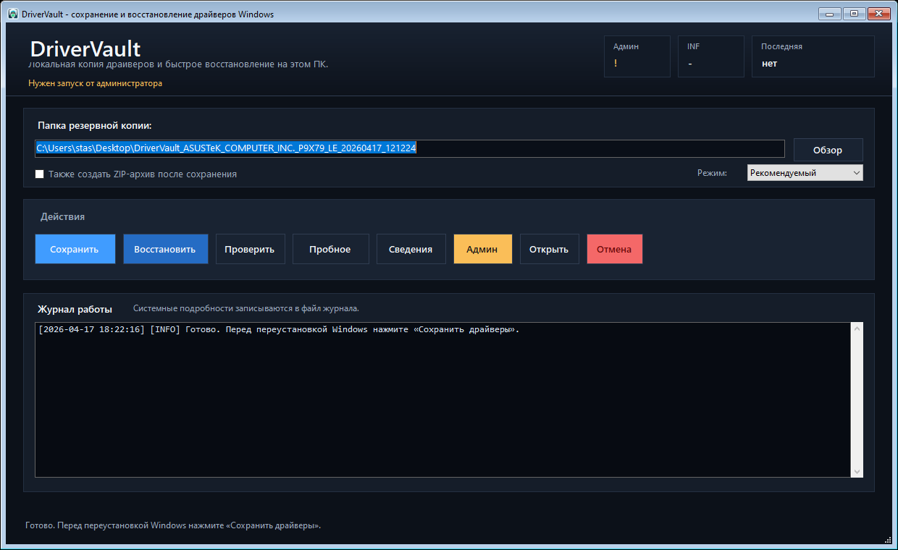

# Документация DriverVault

DriverVault - небольшая утилита для Windows, которая сохраняет драйверы, уже установленные на компьютере, и помогает восстановить их после переустановки Windows. Она полезна в ситуации, когда компьютер сейчас работает нормально, но перед переустановкой системы хочется сохранить локальную копию драйверов.

DriverVault использует штатные инструменты Windows, а не сторонние driver-pack сборки. Это делает процесс более понятным, пригодным для офлайн-использования и проще для проверки.

## Основные возможности

- Графический интерфейс для сохранения, проверки, просмотра и восстановления.
- Русский и английский язык интерфейса.
- Режим **Рекомендуемый** для обычного экспорта сторонних драйверов.
- Режим **Полная копия**, который копирует папки пакетов из DriverStore.
- Проверка целостности файлов через SHA256.
- Режим пробного восстановления, который проверяет копию и показывает, какие INF-пакеты будут добавлены без установки драйверов.
- Понятные ошибки восстановления: нет прав администратора, файл занят, папка повреждена, нет INF-файлов или копия от другого ПК.
- Manifest-файл со сведениями о компьютере, режиме копии, количестве драйверов и датах.
- Автозапуск от имени администратора для сохранения и восстановления.
- Кнопка **Отмена** для долгих операций.
- Простой журнал в окне программы и подробные журналы в папке резервной копии.
- Без постоянных всплывающих окон с кнопкой **OK** во время работы.

## Скриншот



## Для чего нужна программа

Используйте DriverVault, если:

- вы собираетесь переустановить Windows на этом же компьютере;
- хотите сохранить локальную копию рабочих драйверов перед заменой диска или переустановкой системы;
- на компьютере есть старые, редкие или специфичные драйверы производителя;
- хотите избежать случайных driver-pack сборок из интернета.

DriverVault не является программой обновления драйверов. Она не ищет драйверы в интернете, не скачивает новые версии, не заменяет Windows Update и не гарантирует, что копия от одного ПК подойдет другому ПК.

## Требования

- Windows 10 или Windows 11.
- Windows PowerShell 5.1.
- Права администратора для сохранения и восстановления.
- Достаточно свободного места для папки резервной копии.
- Интернет нужен только при сборке EXE, если скрипту потребуется установить PS2EXE для текущего пользователя.

## Скачать для обычных пользователей

Если вы не хотите разбираться с исходным кодом, скачайте готовый EXE-файл из GitHub Releases:

[Скачать DriverVault.exe](https://github.com/StanislavDjango/Driver-Backup/releases/latest/download/DriverVault.exe)

После загрузки нажмите правой кнопкой по `DriverVault.exe` и выберите **Запуск от имени администратора**.

Windows может показать предупреждение SmartScreen для нового open-source EXE-файла, который пока не подписан цифровой подписью. Это не обязательно значит, что файл опасен; это значит, что Windows еще не видела достаточно загрузок от этого издателя. Если сомневаетесь, используйте PowerShell-версию из этого репозитория или попросите технического человека проверить исходный код.

## Режимы сохранения

| Режим | Что делает | Когда использовать |
| --- | --- | --- |
| Рекомендуемый | Запускает `pnputil /export-driver *`, при необходимости пробует DISM. | Лучший вариант по умолчанию для большинства пользователей. |
| Полная копия | Копирует папки пакетов из `C:\Windows\System32\DriverStore\FileRepository`. | Используйте, если штатный экспорт не сработал или нужна максимально полная локальная копия. |

Рекомендуемый режим обычно меньше по размеру и аккуратнее. Полная копия может занимать намного больше места, но иногда спасает пакеты, которые штатные инструменты не экспортируют.

## Как сохранить драйверы

1. Откройте папку проекта.
2. Нажмите правой кнопкой по `DriverVault.cmd`.
3. Выберите **Запуск от имени администратора**.
4. Выберите папку резервной копии.
5. Выберите **Рекомендуемый** или **Полная копия**.
6. Включайте ZIP только если нужен дополнительный архив после сохранения.
7. Нажмите **Сохранить**.
8. Дождитесь итогового сообщения об успешном завершении.
9. Скопируйте всю папку резервной копии на флешку, внешний диск или другое надежное место.

Сделайте это до переустановки Windows. Если копия останется только на системном диске, она может пропасть при переустановке.

## Как восстановить драйверы

1. Установите Windows.
2. Верните папку резервной копии DriverVault на этот же компьютер.
3. Откройте DriverVault от имени администратора.
4. Сначала нажмите **Проверить**.
5. Нажмите **Пробное**, чтобы увидеть, какие INF-пакеты будут отправлены Windows без установки.
6. Если пробная проверка выглядит правильно, нажмите **Восстановить**.
7. После восстановления перезагрузите Windows.

Также можно использовать файл `RESTORE_DRIVERS.cmd`, который создается внутри папки резервной копии. Запускайте его от имени администратора.

## Проверка перед восстановлением

Кнопка **Проверить** не устанавливает драйверы. Она проверяет:

- существует ли папка резервной копии;
- есть ли папка `Drivers`;
- найдены ли `.inf` файлы;
- похожи ли сведения о компьютере на текущий ПК;
- совпадают ли SHA256-суммы файлов.

Если проверка не прошла, не восстанавливайте драйверы из этой копии, пока не станет понятно, в чем проблема.

## Пробное восстановление

Кнопка **Пробное** не устанавливает драйверы. Она выполняет предварительную проверку восстановления и создает отчёт в `Logs/`, где видно:

- есть ли INF-файлы;
- читаются ли файлы драйверов;
- совпадает ли сохраненная информация о компьютере с текущим ПК;
- какие INF-пакеты будут отправлены Windows при восстановлении;
- Provider, Class и DriverVer, если эти данные удалось прочитать из INF-файла.

Используйте этот режим перед кнопкой **Восстановить**, если хотите убедиться, что копия полная и подходит этому компьютеру.

## Что находится в резервной копии

| Путь | Назначение |
| --- | --- |
| `Drivers/` | Экспортированные или скопированные пакеты драйверов. |
| `manifest.json` | Метаданные копии, сведения о компьютере, режим и количество драйверов. |
| `checksums.json` | SHA256-суммы для проверки целостности. |
| `installed-drivers.json` | Структурированный список установленных подписанных PnP-драйверов. |
| `installed-drivers.csv` | Список драйверов в формате, удобном для таблиц. |
| `pnputil-enum-drivers.txt` | Исходный список драйверов из хранилища Windows. |
| `Logs/` | Журналы сохранения, восстановления и диагностики. |
| `RESTORE_DRIVERS.cmd` | Запуск восстановления из этой папки в один клик. |
| `DriverVault.ps1` | Копия утилиты, сохраненная вместе с резервной копией. |
| `FAILED_DO_NOT_USE.txt` | Метка, которая появляется только если сохранение сорвалось. |

Если есть файл `FAILED_DO_NOT_USE.txt`, считайте такую резервную копию неполной.

## Использование из командной строки

DriverVault можно запускать без графического интерфейса.

```powershell
powershell.exe -NoProfile -ExecutionPolicy Bypass -File .\DriverVault.ps1 -Mode Gui
```

Создать рекомендуемую копию:

```powershell
powershell.exe -NoProfile -ExecutionPolicy Bypass -File .\DriverVault.ps1 -Mode Backup -BackupPath "D:\DriverVault_Backup" -BackupScope Recommended
```

Создать полную копию:

```powershell
powershell.exe -NoProfile -ExecutionPolicy Bypass -File .\DriverVault.ps1 -Mode Backup -BackupPath "D:\DriverVault_Backup" -BackupScope Full
```

Проверить существующую копию:

```powershell
powershell.exe -NoProfile -ExecutionPolicy Bypass -File .\DriverVault.ps1 -Mode Validate -BackupPath "D:\DriverVault_Backup"
```

Пробное восстановление без установки драйверов:

```powershell
powershell.exe -NoProfile -ExecutionPolicy Bypass -File .\DriverVault.ps1 -Mode DryRun -BackupPath "D:\DriverVault_Backup"
```

Посмотреть сведения о копии:

```powershell
powershell.exe -NoProfile -ExecutionPolicy Bypass -File .\DriverVault.ps1 -Mode Inspect -BackupPath "D:\DriverVault_Backup"
```

Восстановить драйверы:

```powershell
powershell.exe -NoProfile -ExecutionPolicy Bypass -File .\DriverVault.ps1 -Mode Restore -BackupPath "D:\DriverVault_Backup"
```

## Параметры

| Параметр | Значения | Описание |
| --- | --- | --- |
| `-Mode` | `Gui`, `Backup`, `Restore`, `Inspect`, `Validate`, `DryRun` | Выбор операции. |
| `-BackupPath` | путь к папке | Папка для создания, просмотра, проверки или восстановления копии. |
| `-BackupScope` | `Recommended`, `Full` | Режим сохранения. Используется в `Backup`. |
| `-CreateZip` | переключатель | Создает ZIP-архив после сохранения. |
| `-Language` | `Auto`, `ru`, `en` | Язык интерфейса и журнала. |
| `-NoPause` | переключатель | Не останавливает консоль после ошибок. Удобно для скриптов. |

## Сборка EXE

Версии `.ps1` и `.cmd` достаточно для запуска DriverVault. Если нужен отдельный EXE-лаунчер, выполните:

```powershell
powershell.exe -NoProfile -ExecutionPolicy Bypass -File .\Build-DriverVaultExe.ps1
```

Результат сборки появится здесь:

```text
dist\DriverVault.exe
```

Скрипт использует PS2EXE. Если PS2EXE отсутствует, скрипт может установить его для текущего пользователя.

## Автоматические релизы

GitHub Actions автоматически собирает EXE при каждом push и pull request. Когда отправляется тег версии вроде `v0.3.1`, workflow также создает или обновляет GitHub Release и загружает:

- `DriverVault.exe`;
- `DriverVault.exe.sha256`;
- `DriverVault-vX.Y.Z.zip`.

## Решение частых проблем

### Сохранение или восстановление требует права администратора

Закройте программу и запустите `DriverVault.cmd` через **Запуск от имени администратора**. Графический интерфейс также может перезапустить себя с повышенными правами при нажатии сохранения или восстановления.

### Не найдено INF-файлов

Некоторые установки Windows используют только встроенные драйверы Microsoft. Они уже входят в Windows и часто не экспортируются. Попробуйте режим **Полная копия**, если вы ожидали наличие драйверов производителя.

### Проверка SHA256 не прошла

Копия могла быть повреждена, скопирована не полностью или изменена после создания. Скопируйте ее заново с исходного носителя или создайте новую резервную копию.

### Понятные ошибки

DriverVault показывает короткую причину в окне программы, а технические подробности оставляет в файле журнала:

| Сообщение | Что делать |
| --- | --- |
| Нет прав администратора | Перезапустите DriverVault через **Запуск от имени администратора**. |
| Файл занят | Закройте Проводник, установщики, Диспетчер устройств или проверку антивируса для папки копии. |
| Папка резервной копии повреждена | Скопируйте резервную копию заново или создайте новую. |
| В копии нет INF-файлов | Выберите настоящую папку DriverVault или создайте **Полную копию**, если нужно. |
| Копия создана для другого ПК | Не восстанавливайте её, если точно не знаете, что железо совместимо. |

### Предупреждение, что компьютер не совпадает

DriverVault предупреждает, если копия похожа на копию от другого ПК. Кнопка **Пробное** всё равно создаёт отчёт, но настоящее **Восстановить** останавливается, чтобы защитить текущую Windows.

### После восстановления устройство все равно без драйвера

Сначала перезагрузите Windows. Затем проверьте Диспетчер устройств. Некоторым устройствам нужен установщик производителя, который добавляет службы, панели управления или firmware-компоненты помимо `.inf` драйвера.

## Приватность

DriverVault ничего никуда не отправляет. Но резервная копия может содержать идентификаторы оборудования, сведения о модели компьютера и названия драйверов. Не публикуйте реальные резервные копии своего компьютера, если не хотите делиться такой информацией.

## Участие в разработке

Улучшения приветствуются. Начните с [CONTRIBUTING.md](../../CONTRIBUTING.md), делайте изменения небольшими и проверяйте сценарии сохранения/проверки перед pull request.
